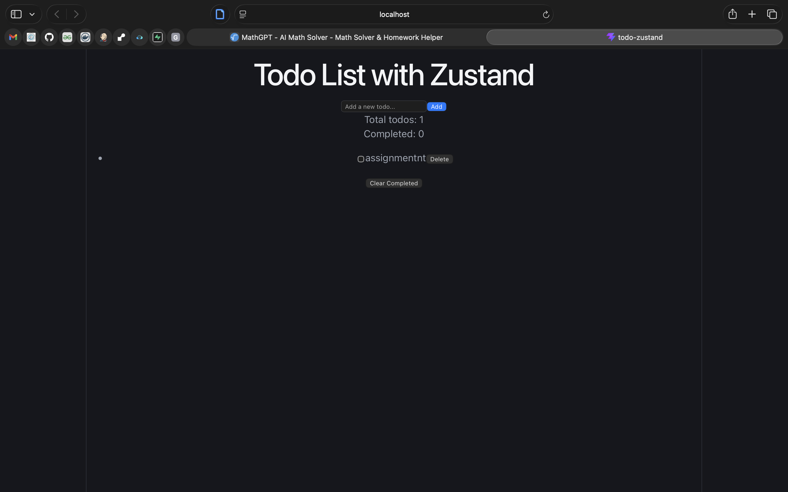

# Todo List Application with Zustand - Practical 6

## Project Overview

The project is a simple Todo List application using React and Zustand for state management. 

---

## Technology Stack

### Frontend:
- **Framework:** React (Vite)
- **State Management:** Zustand
- **Styling:** Default CSS 

### Backend:
- No backend required (client-side only)

---

## Setup Instructions

### 1. Create a new React project

```bash
npm create vite@latest todo-zustand -- --template react
cd todo-zustand
npm install
npm install zustand
```

### 2. Set up the project structure

Create the following folder structure in your `src` directory:

```
src/
  components/
    TodoInput.jsx
    TodoItem.jsx
    TodoList.jsx
  store/
    todoStore.js
  App.jsx
  main.jsx
```

### 3. Start the development server

```bash
npm run dev
```

### 4. Open application

Navigate to **http://localhost:5173**

---

## State Management with Zustand

### Store Creation

Create the Zustand store in `src/store/todoStore.js`:

```javascript
import { create } from 'zustand'

const useTodoStore = create((set) => ({
  todos: [],

  addTodo: (text) => set((state) => ({
    todos: [...state.todos, { 
      id: Date.now(), 
      text, 
      completed: false 
    }]
  })),

  toggleTodo: (id) => set((state) => ({
    todos: state.todos.map(todo => 
      todo.id === id ? { ...todo, completed: !todo.completed } : todo
    )
  })),

  removeTodo: (id) => set((state) => ({
    todos: state.todos.filter(todo => todo.id !== id)
  })),

  clearCompleted: () => set((state) => ({
    todos: state.todos.filter(todo => !todo.completed)
  }))
}))

export default useTodoStore
```

### Key Zustand Concepts

| Concept | Description |
|---------|-------------|
| **Store Creation** | Using Zustand's `create` function to make a central store containing state and actions |
| **State Access** | Components access state using the hook: `useTodoStore(state => state.todos)` |
| **State Updates** | Components call actions from the store to update state using the `set` function for immutable updates |
| **Selective Subscriptions** | Components only subscribe to specific pieces of state they need, preventing unnecessary re-renders |

---

## Key Components

### TodoInput Component

Provides a form for adding new todos with text input and submit button.

**File:** `src/components/TodoInput.jsx`

```javascript
import { useState } from 'react'
import useTodoStore from '../store/todoStore'

function TodoInput() {
  const [text, setText] = useState('')
  const addTodo = useTodoStore(state => state.addTodo)

  const handleSubmit = (e) => {
    e.preventDefault()
    if (text.trim()) {
      addTodo(text)
      setText('')
    }
  }

  return (
    <form onSubmit={handleSubmit}>
      <input 
        type="text" 
        value={text} 
        onChange={(e) => setText(e.target.value)} 
        placeholder="Add a new todo..." 
      />
      <button type="submit">Add</button>
    </form>
  )
}

export default TodoInput
```

### TodoItem Component

Displays individual todo items with checkbox to toggle completion and delete button.

**File:** `src/components/TodoItem.jsx`

```javascript
import useTodoStore from '../store/todoStore'

function TodoItem({ todo }) {
  const toggleTodo = useTodoStore(state => state.toggleTodo)
  const removeTodo = useTodoStore(state => state.removeTodo)

  return (
    <li>
      <input 
        type="checkbox" 
        checked={todo.completed} 
        onChange={() => toggleTodo(todo.id)} 
      />
      <span style={{ 
        textDecoration: todo.completed ? 'line-through' : 'none' 
      }}>
        {todo.text}
      </span>
      <button onClick={() => removeTodo(todo.id)}>Delete</button>
    </li>
  )
}

export default TodoItem
```

### TodoList Component

Manages the collection of TodoItem components and provides clear completed functionality.

**File:** `src/components/TodoList.jsx`

```javascript
import useTodoStore from '../store/todoStore'
import TodoItem from './TodoItem'

function TodoList() {
  const todos = useTodoStore(state => state.todos)
  const clearCompleted = useTodoStore(state => state.clearCompleted)

  return (
    <div>
      <ul>
        {todos.map(todo => (
          <TodoItem key={todo.id} todo={todo} />
        ))}
      </ul>
      
      {todos.length > 0 && (
        <button onClick={clearCompleted}>Clear Completed</button>
      )}
    </div>
  )
}

export default TodoList
```

### App Component

The main component that orchestrates everything and displays todo statistics.

**File:** `src/App.jsx`

```javascript
import TodoInput from './components/TodoInput'
import TodoList from './components/TodoList'
import useTodoStore from './store/todoStore'

function App() {
  const todoCount = useTodoStore(state => state.todos.length)
  const completedCount = useTodoStore(
    state => state.todos.filter(todo => todo.completed).length
  )

  return (
    <div className="App">
      <h1>Todo List with Zustand</h1>
      
      <TodoInput />
      
      <div>
        <p>Total todos: {todoCount}</p>
        <p>Completed: {completedCount}</p>
      </div>
      
      <TodoList />
    </div>
  )
}

export default App
```

---
## Final Output

---

## Features Implemented

### Core Todo Features

| Feature | Description |
|---------|-------------|
| Add Todo | Users can add new todos with text input |
| Toggle Completion | Mark todos as complete/incomplete with checkbox |
| Delete Todo | Remove individual todos from the list |
| Clear Completed | Remove all completed todos at once |
| Real-time Counters | Display total todos and completed count |

### State Management Benefits

- No prop drilling between components
- Components only re-render when their subscribed state changes
- Simple, minimal boilerplate code
- Easy to add new features and actions

---

## Known Challenges & Solutions

### Challenge 1: File Extension Issues
**Issue:** Vite expected `.jsx` extension for files containing JSX  
**Solution:** Renamed `App.js` to `App.jsx` and ensured all component files have correct `.jsx` extension

### Challenge 2: JSX Parser Error
**Issue:** "Unexpected JSX expression" error because Vite's parser didn't recognize JSX in `.js` files  
**Solution:** Changed `main.jsx` to import `App.jsx` and ensured all JSX files have `.jsx` extension

### Challenge 3: Understanding Zustand Syntax
**Issue:** Initial confusion about Zustand's `set` function and immutable updates  
**Solution:** Studied Zustand documentation and implemented simple actions first

---

## Notes

- The application uses Zustand for all state management
- Each component subscribes only to the state it needs for optimal performance
- The store is centralized in `/store/todoStore.js` for easy maintenance
- The frontend (port 5173) must be running to use the application

---


## References

- Zustand Documentation: https://docs.pmnd.rs/zustand
- React Documentation: https://react.dev
- Vite Documentation: https://vitejs.dev
